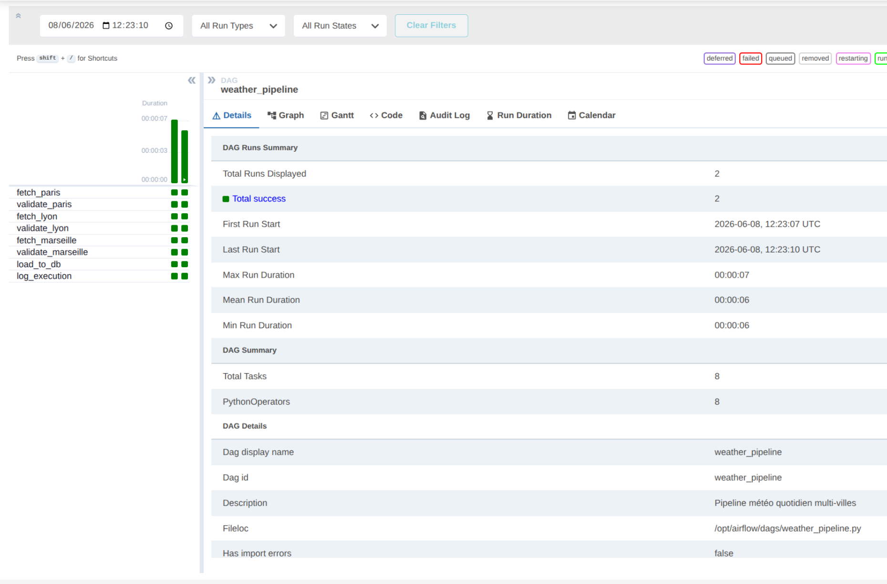
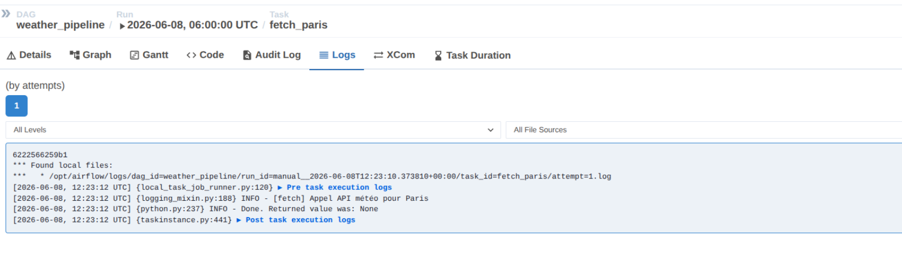

# TP DAG Airflow

## Environnement utilisé

- Ubuntu 24
- Docker + Docker Compose v5.1.1
- Apache Airflow 2.9.1 (image officielle)
- Python 3.13

---

## Lancement de l'environnement

```bash
# Initialisation
docker-compose up airflow-init

# Démarrage des services
docker-compose up -d

# Vérification
docker-compose ps
```

L'interface web est accessible sur **http://localhost:8080**  
Login : `airflow` / Password : `airflow`

---

## Structure du projet

```
first_rag/
├── dags/
│   └── weather_pipeline.py   # fichier DAG
├── logs/                     # logs générés par Airflow
├── plugins/                 
├── screenshots/              
├── docker-compose.yaml
└── .env
```

---

## Description du DAG

**Fichier :** `dags/weather_pipeline.py`  
**DAG ID :** `weather_pipeline`  
**Schedule :** tous les jours à 06h00 (`0 6 * * *`)  
**Villes traitées :** Paris, Lyon, Marseille

### Tâches et rôles

| Tâche | Rôle |
|---|---|
| `fetch_paris/lyon/marseille` | Simule l'appel à une API météo externe pour chaque ville |
| `validate_paris/lyon/marseille` | Vérifie que les champs requis sont présents (température, humidité, vent) |
| `load_to_db` | Point de convergence — insère les données des 3 villes validées en base |
| `log_execution` | Toujours exécuté (succès ou échec), trace le statut final du run |

### Dépendances

```
fetch_paris     → validate_paris     ─┐
fetch_lyon      → validate_lyon      ─┼─► load_to_db ──► log_execution
fetch_marseille → validate_marseille ─┘
```

- Les fetches et validations s'exécutent **en parallèle** par ville
- `load_to_db` attend que les **3 validations** soient terminées (fan-in)
- `log_execution` utilise `trigger_rule="all_done"` pour toujours s'exécuter

### Gestion des échecs

Chaque tâche possède un `on_failure_callback` qui déclenche une alerte si elle échoue. Le run des autres villes continue normalement.

---

## Preuve d'exécution

### Screenshot 1 - Succes de l'exécution du DAG


### Screenshot 2 — Logs de la tâche fetch_paris
