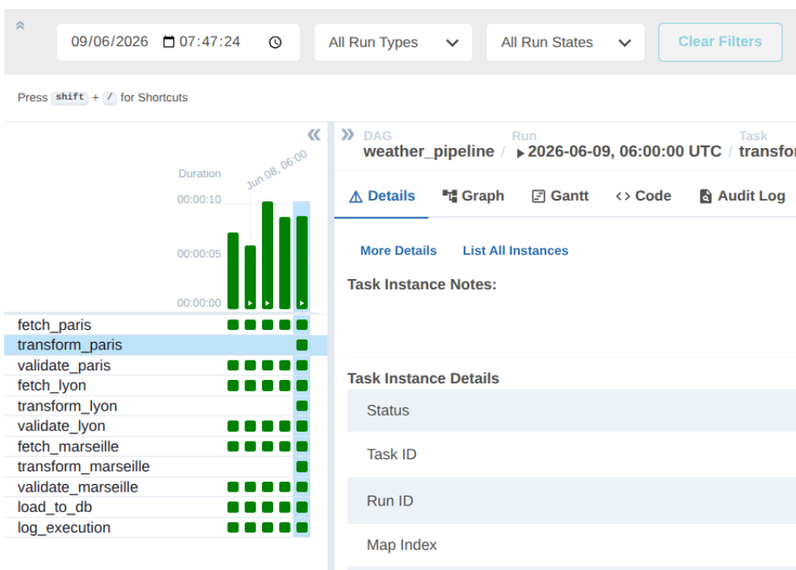
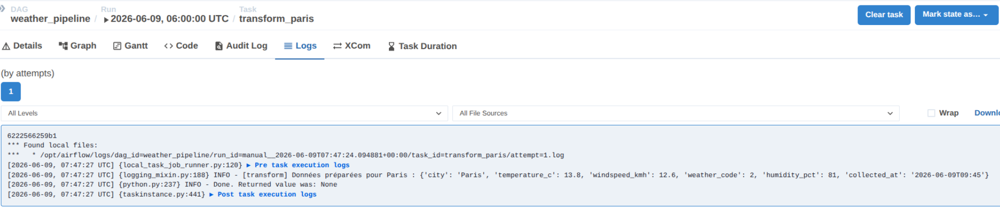
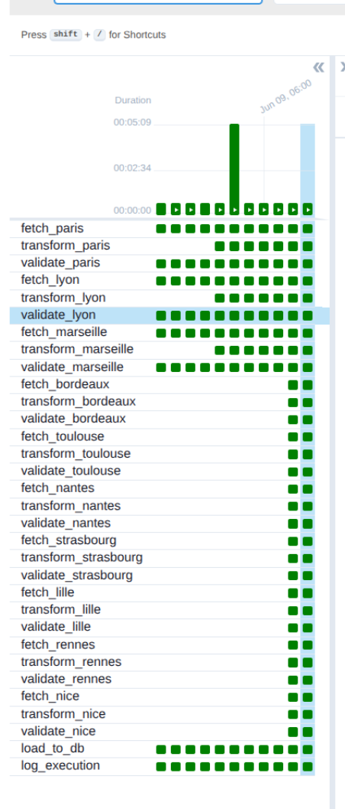
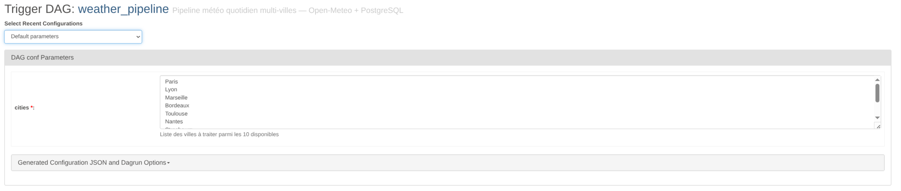
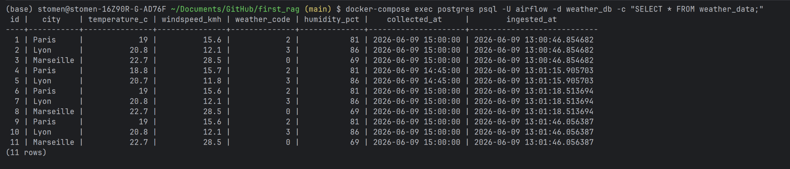
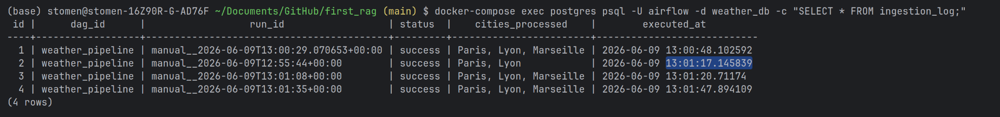

# TP DAG Airflow

## Environnement utilisé

- Ubuntu 24
- Docker + Docker Compose v5.1.1
- Apache Airflow 2.9.1 (image officielle)
- Python 3.13

---

## Lancement de l'environnement

```bash
# Initialisation
docker-compose up airflow-init

# Démarrage des services
docker-compose up -d

# Vérification
docker-compose ps
```

L'interface web est accessible sur **http://localhost:8080**  
Login : `airflow` / Password : `airflow`

---

## Structure du projet

```
first_rag/
├── dags/
│   └── weather_pipeline.py   # fichier DAG
├── logs/                     # logs générés par Airflow
├── plugins/                 
├── screenshots/              
├── docker-compose.yaml
└── .env
```

---

## Description du DAG

**Fichier :** `dags/weather_pipeline.py`  
**DAG ID :** `weather_pipeline`  
**Schedule :** tous les jours à 06h00 (`0 6 * * *`)  
**Villes traitées :** Paris, Lyon, Marseille

### Tâches et rôles

| Tâche | Rôle |
|---|---|
| `fetch_paris/lyon/marseille` | Simule l'appel à une API météo externe pour chaque ville |
| `validate_paris/lyon/marseille` | Vérifie que les champs requis sont présents (température, humidité, vent) |
| `load_to_db` | Point de convergence — insère les données des 3 villes validées en base |
| `log_execution` | Toujours exécuté (succès ou échec), trace le statut final du run |

### Dépendances

```
fetch_paris     → validate_paris     ─┐
fetch_lyon      → validate_lyon      ─┼─► load_to_db ──► log_execution
fetch_marseille → validate_marseille ─┘
```

- Les fetches et validations s'exécutent **en parallèle** par ville
- `load_to_db` attend que les **3 validations** soient terminées (fan-in)
- `log_execution` utilise `trigger_rule="all_done"` pour toujours s'exécuter

### Gestion des échecs

Chaque tâche possède un `on_failure_callback` qui déclenche une alerte si elle échoue. Le run des autres villes continue normalement.

---

## Preuve d'exécution

### Screenshot 1 - Succes de l'exécution du DAG


### Screenshot 2 — Logs de la tâche fetch_paris


---

# TP 2A — Préparer une ingestion API météo

## Sujet

Brancher une vraie API météo (Open-Meteo) et séparer la logique de récupération de la logique de transformation.

---

## Modifications apportées au DAG

Une nouvelle couche `transform_*` a été ajoutée entre `fetch_*` et `validate_*`.

### Nouvelle chaîne de dépendances par ville

```
fetch_paris     → transform_paris     → validate_paris     ─┐
fetch_lyon      → transform_lyon      → validate_lyon      ─┼─► load_to_db ──► log_execution
fetch_marseille → transform_marseille → validate_marseille ─┘
```

### Tâches et rôles

| Tâche | Rôle |
|---|---|
| `fetch_*` | Appel HTTP réel à l'API Open-Meteo, stocke le JSON brut en XCom |
| `transform_*` | Extrait uniquement les champs utiles du JSON brut, stocke le résultat en XCom |
| `validate_*` | Vérifie que tous les champs requis sont présents et non nuls |
| `load_to_db` | Récupère les données transformées des 3 villes et les insère en base |
| `log_execution` | Toujours exécuté, trace le statut final du run |

### Champs retenus et justification

| Champ | Source | Justification |
|---|---|---|
| `temperature_c` | `current_weather.temperature` | Donnée métier principale |
| `windspeed_kmh` | `current_weather.windspeed` | Indicateur de conditions météo |
| `weather_code` | `current_weather.weathercode` | Code WMO — type de météo (0=clair, 2=nuageux…) |
| `humidity_pct` | `hourly.relativehumidity_2m[0]` | Complément utile, non présent dans current_weather |
| `collected_at` | `current_weather.time` | Horodatage de la mesure pour traçabilité |

---

## Preuve d'exécution

### Screenshot 3 — Vue Grid avec les nouvelles tâches transform


### Screenshot 4 — Logs de transform_paris avec les vraies données


---
 
# TP 2B — Pipeline complet API → transformation → PostgreSQL
 
## Objectif
 
Construire un pipeline orchestré complet à partir d'Open-Meteo : récupération API, transformation, chargement PostgreSQL, traçabilité et paramétrage.

---
## Modifications apportées au DAG
 
- Branchement d'un vrai PostgreSQL pour le chargement des données
- Remplacement du `print` de `load_to_db` par de vraies insertions SQL
- Remplacement de `log_execution` par `log_ingestion` qui écrit dans une table de suivi
- Ajout des DAG Params pour rendre les villes configurables au trigger
- Extension de `DEFAULT_CITIES` à 10 villes disponibles
---
 
## Script SQL
 
```sql
CREATE TABLE weather_data (
    id SERIAL PRIMARY KEY,
    city VARCHAR(100) NOT NULL,
    temperature_c FLOAT NOT NULL,
    windspeed_kmh FLOAT NOT NULL,
    weather_code INT NOT NULL,
    humidity_pct INT NOT NULL,
    collected_at TIMESTAMP NOT NULL,
    ingested_at TIMESTAMP DEFAULT NOW()
);
 
CREATE TABLE ingestion_log (
    id SERIAL PRIMARY KEY,
    dag_id VARCHAR(100),
    run_id VARCHAR(255),
    status VARCHAR(50),
    cities_processed TEXT,
    executed_at TIMESTAMP DEFAULT NOW()
);
```
 
---
 
## Villes disponibles
 
| Ville | Latitude | Longitude |
|---|---|---|
| Paris | 48.8566 | 2.3522 |
| Lyon | 45.7640 | 4.8357 |
| Marseille | 43.2965 | 5.3698 |
| Bordeaux | 44.8378 | -0.5792 |
| Toulouse | 43.6047 | 1.4442 |
| Nantes | 47.2184 | -1.5536 |
| Strasbourg | 48.5734 | 7.7521 |
| Lille | 50.6292 | 3.0573 |
| Rennes | 48.1173 | -1.6778 |
| Nice | 43.7102 | 7.2620 |
 
---
 
## DAG paramétrable
 
Au moment du trigger, le champ `cities` permet de choisir quelles villes traiter parmi les 10 disponibles. Les tâches des villes non sélectionnées s'exécutent mais retournent immédiatement sans traitement.
 
---
 
## Preuve de bon fonctionnement
 
### Screenshot 5 — Vue Grid avec les 10 villes


### Screenshot 6 — Trigger avec villes personnalisées

### Screenshot 7 — Données en base

### Screenshot 8 — Table de suivi

 